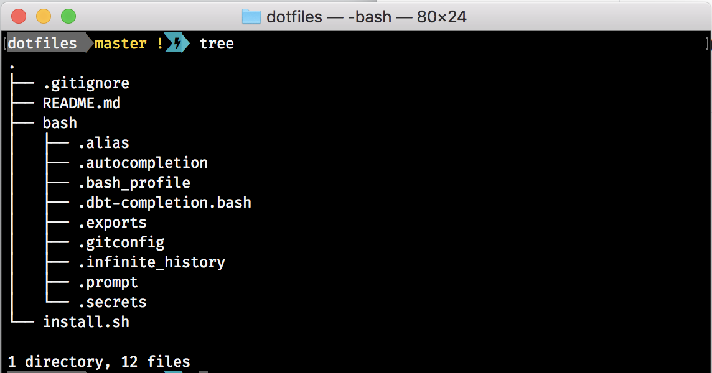
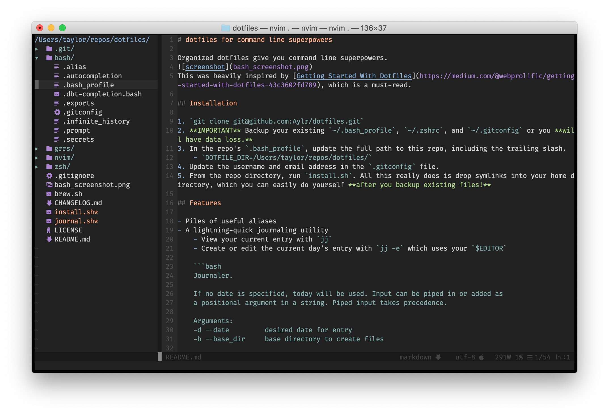

# dotfiles for command line superpowers

Organized dotfiles give you command line superpowers.

This was heavily inspired by [Getting Started With Dotfiles](https://medium.com/@webprolific/getting-started-with-dotfiles-43c3602fd789), which is a must-read.

## Installation

1. `git clone git@github.com:Aylr/dotfiles.git`
2. **IMPORTANT** Backup your existing `~/.bash_profile`, `~/.zshrc`, and `~/.gitconfig` or you **will have data loss.**
3. In the repo's `.bash_profile`, update the full path to this repo, including the trailing slash.
    - `DOTFILE_DIR=/Users/taylor/repos/dotfiles/`
4. Update the username and email address in the `.gitconfig` file.
5. From the repo directory, run `brew.sh` to install a few programs with brew.
6. From the repo directory, run `install.sh`. All this really does is drop symlinks into your home directory, which you can easily do yourself **after you backup existing files!**


## Features

- Piles of useful aliases
- A nice themed neovim setup 
- A lightning-quick journaling utility
    - View your current entry with `jj`
    - Create or edit the current day's entry with `jj -e` which uses your `$EDITOR`

    ```bash
    Journaler.
    
    If no date is specified, today will be used. Input can be piped in or added as
    a positional argument in a string. Piped input takes precedence.
    
    Arguments:
    -d --date         desired date for entry
    -b --base_dir     base directory to create files
    
    Options
    -e --edit         open entry in editor - uses \$EDITOR if available
    -h --help         show this help and exit
    -v --verbose      show verbose output
    
    Usage
    
    journal.sh                              View today's entry
    journal.sh -e                           Edit today's entry
    journal.sh "TIL something neat"         Add a note to today's entry
    journal.sh "TIL something neat" -e      Add a note to today's entry and edit
    journal.sh -d 2020-01-01                View the entry from 1/1/20
    cat file.txt | journal.sh               Pipe file.txt into today's entry
    ```
## Notes

- **Non secret** exports are kept in `bash/.exports`
- **Secret exports** are kept in `bash/.secrets`, which are of course in the `.gitignore`

## References

- [Maximize Developer productivity on a Mac](https://medium.com/@ankushagarwal/maximize-developer-productivity-on-a-mac-a9ae6fbaedab)
